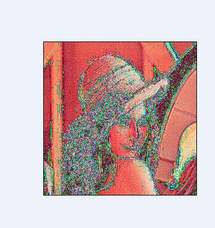
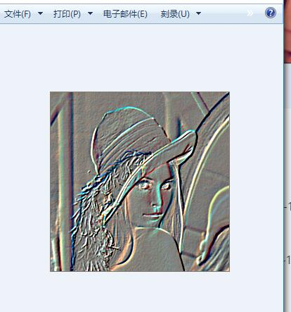

``

```c++
#include <iostream>
using namespace std;
#include "./gdal/gdal_priv.h"
#pragma comment(lib, "gdal_i.lib")


int main()
{
	int  a[3][3] = { 0,1,0,1,1,1,0,1,0 };
	int b[5][5] = {1,0,0,0,0,0,1,0,0,0,0,0,1,0,0,0,0,0,1,0,0,0,0,0,1};
	int c[3][3] = { -1,-1,-1,-1,8,-1,-1,-1,-1};
	int d[3][3] = { -1,-1,-1,-1,9,-1,-1,-1,-1 };
	double e[3][3] = {-1,-1,0,-1,0,1,0,1,1};
	float f[5][5] = { 0.0120,0.1253,0.2736,0.1253,0.0120,0.1253,1.3054,2.8514,1.3054,0.1253,2.2736,2.8514,6.2279,2.8514,0.2736,0.1253,1.3054,2.8514,1.3054,0.1253,0.0120,0.1253,0.2736,0.1253,0.0120 };
	//输入图像space.jpg
	GDALDataset* poSrcDS1;

	//输入图像superman.jpg

	//输出图像
	GDALDataset* poDstDS;
	//图像的宽度和高度
	int imgXlen1, imgYlen1;


	//输入图像路径
	char* srcPath1 = "lina.jpg";

	//输出图像路径
	char* dstPath = "resc.tif";
	//图像内存存储,改变区域内存存储
	GByte *buffTmp, *buffTmpR1, *buffTmpG1, *buffTmpB1,*bufftmp1, *bufftmp2, *bufftmp3;
	//图像波段数
	int i, j, bandNum1;
	//注册驱动
	GDALAllRegister();
	//打开图像
	poSrcDS1 = (GDALDataset*)GDALOpenShared(srcPath1, GA_ReadOnly);


	//获取图像的宽度，高度和波段数
	imgXlen1 = poSrcDS1->GetRasterXSize();
	imgYlen1 = poSrcDS1->GetRasterYSize();

	bandNum1 = poSrcDS1->GetRasterCount();

	//根据图像的宽度和高度分配内存
	//buffTmp = (GByte*)CPLMalloc(imgXlen1*imgYlen1 * sizeof(GByte));
	//创建输出图像
	poDstDS = GetGDALDriverManager()->GetDriverByName("GTiff")->Create(
		dstPath, imgXlen1, imgYlen1, bandNum1, GDT_Byte, NULL);
	//将图片输出到新建的图片


	//读取红色通道缓存在buffTmp中，只是为了获取该区域
	buffTmpR1 = (GByte*)CPLMalloc(imgXlen1*imgYlen1 * sizeof(GByte));
	buffTmpB1 = (GByte*)CPLMalloc(imgXlen1*imgYlen1 * sizeof(GByte));
	buffTmpG1 = (GByte*)CPLMalloc(imgXlen1*imgYlen1 * sizeof(GByte));
	bufftmp1 = (GByte*)CPLMalloc(imgXlen1*imgYlen1 * sizeof(GByte));
	bufftmp2 = (GByte*)CPLMalloc(imgXlen1*imgYlen1 * sizeof(GByte));
	bufftmp3 = (GByte*)CPLMalloc(imgXlen1*imgYlen1 * sizeof(GByte));
	poSrcDS1->GetRasterBand(1)->RasterIO(GF_Read, 0, 0, imgXlen1, imgYlen1, buffTmpR1, imgXlen1, imgYlen1, GDT_Byte, 0, 0);
	//依次读取三个通道的像素
	poSrcDS1->GetRasterBand(2)->RasterIO(GF_Read, 0, 0, imgXlen1, imgYlen1, buffTmpG1, imgXlen1, imgYlen1, GDT_Byte, 0, 0);
	poSrcDS1->GetRasterBand(3)->RasterIO(GF_Read, 0, 0, imgXlen1, imgYlen1, buffTmpB1, imgXlen1, imgYlen1, GDT_Byte, 0, 0);


	//遍历区域，将新建图片该区域改变颜色
	double tempR = 0;
	double tempG = 0;
	double tempB = 0;
	for (j = 0; j < imgYlen1; j++)
		for (i = 0; i < imgXlen1; i++)
		{
			if (j == 0 || i == 0 || j == imgYlen1 - 1 || i == imgXlen1 - 1)
			{
				tempR = 0;
				tempG = 0;
				tempB = 0;
			}
			else
			{
				tempR = 0;
				tempG = 0;
				tempB = 0;
				for (int m = 0; m < 3; m++)//第一个卷积核
				{
					for (int n = 0; n < 3; n++)
					{
						tempR += (double)buffTmpR1[(j + m - 1) * imgXlen1 + (i + n - 1)] * c[m][n];
						tempG += (double)buffTmpG1[(j + m - 1) * imgXlen1 + (i + n - 1)] * c[m][n];
						tempB += (double)buffTmpB1[(j + m- 1) * imgXlen1 + (i + n - 1)] * c[m][n];

					}
				}
				//for (int m = 0; m < 5; m++)//第二\六个卷积核，目测是模糊的
				//{
				//	for (int n = 0; n < 5; n++)
				//	{
				//	tempR += (double)buffTmpR1[(j + m - 1) * imgXlen1 + (i + n - 1)] * b[m][n];
				//		tempG += (double)buffTmpG1[(j + m - 1) * imgXlen1 + (i + n - 1)] * b[m][n];
				//		tempB += (double)buffTmpB1[(j + m - 1) * imgXlen1 + (i + n - 1)] * b[m][n];

				//	}
				//}
			/*	for (int m = 0; m < 5; m++)//第3,4,5个卷积核
				{
					for (int n = 0; n < 5; n++)
					{
						tempR += ((double)buffTmpR1[(j + m - 1) * imgXlen1 + (i + n - 1)]) * f[m][n];
						tempG += ((double)buffTmpG1[(j + m - 1) * imgXlen1 + (i + n - 1)]) * f[m][n];
						tempB += ((double)buffTmpB1[(j + m - 1) * imgXlen1 + (i + n - 1)]) * f[m][n];

					}
				}*/
			}
			bufftmp1[j * imgXlen1 + i] = tempR;
			bufftmp2[j * imgXlen1 + i] = tempG;
			bufftmp3[j * imgXlen1 + i] = tempB;
			/*bufftmp1[j * imgXlen1 + i] = tempR/25;
			bufftmp2[j * imgXlen1 + i] = tempG/25;
			bufftmp3[j * imgXlen1 + i] = tempB/25;*/
			/*double value;
			if (tempR + 128 > 255)
				bufftmp1[j * imgXlen1 + i] = 255;
			else if (tempR + 128 < 0)
				bufftmp1[j * imgXlen1 + i] = 0;
			else
			
				bufftmp1[j * imgXlen1 + i] = unsigned char(tempR+128);
			
			if (tempG + 128 > 255)
				bufftmp2[j * imgXlen1 + i] = 255;
			else if (tempG + 128 < 0)
				bufftmp2[j * imgXlen1 + i] = 0;
			else

				bufftmp2[j * imgXlen1 + i] = unsigned char (tempG+128);
			
			if (tempB + 128 > 255)
				bufftmp3[j * imgXlen1 + i] = 255;
			else if (tempB+128<0)
				bufftmp3[j * imgXlen1 + i] = 0;
			else

				bufftmp3[j * imgXlen1 + i] =unsigned char( tempB+128);*/

		}


	poDstDS->GetRasterBand(1)->RasterIO(GF_Write, 0, 0, imgXlen1, imgYlen1, bufftmp1, imgXlen1, imgYlen1, GDT_Byte, 0, 0);
	poDstDS->GetRasterBand(2)->RasterIO(GF_Write, 0, 0, imgXlen1, imgYlen1, bufftmp2, imgXlen1, imgYlen1, GDT_Byte, 0, 0);
	poDstDS->GetRasterBand(3)->RasterIO(GF_Write, 0, 0, imgXlen1, imgYlen1, bufftmp3, imgXlen1, imgYlen1, GDT_Byte, 0, 0);


	//清除内存

	CPLFree(buffTmpR1);
	CPLFree(buffTmpG1);
	CPLFree(buffTmpB1);
	CPLFree(bufftmp1);
	CPLFree(bufftmp2);
	CPLFree(bufftmp3);

	//关闭dataset
	GDALClose(poDstDS);
	GDALClose(poSrcDS1);
	system("PAUSE");
	return 0;
}
```

``  图片

上面这个是运动模糊：

 ](gaosimohu.jpg)


上面这个是高斯模糊：

  

 

上面这个是锐化吧。 用矩阵int  a[3][3] = { 0,1,0,1,1,1,0,1,0 };得到的

   

 

上面是用第四个矩阵得到，但是我在最后乘了0.2int d[3][3] = { -1,-1,-1,-1,9,-1,-1,-1,-1 };

因为不成都看不出是什么图了，就一堆乱七八糟的 ，不知道为什么

上面是用第三个矩阵得到，但是我在最后乘了0.2int c[3][3] = { -1,-1,-1,-1,8,-1,-1,-1,-1}* !

因为不成都看不出是什么图了，就一堆乱七八糟的 ，不知道为什么 

 

上面是用第五个矩阵做的，它应该是浮雕的

 