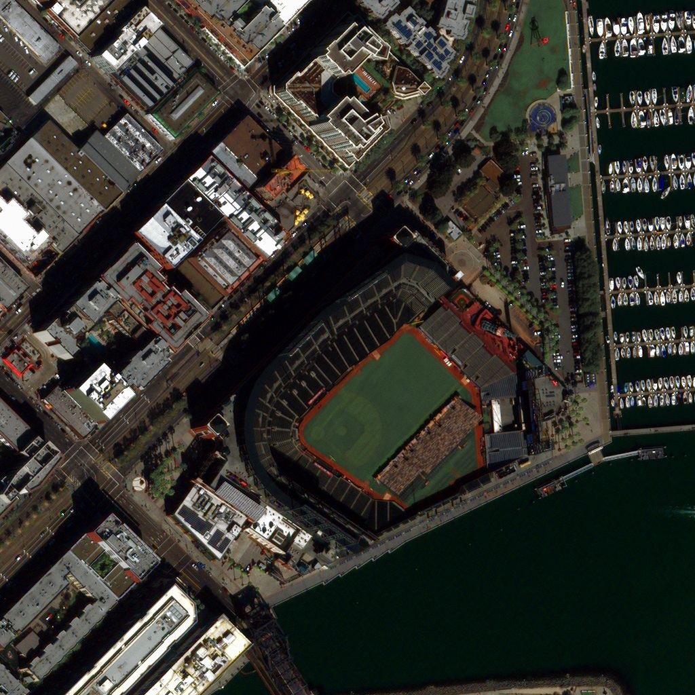
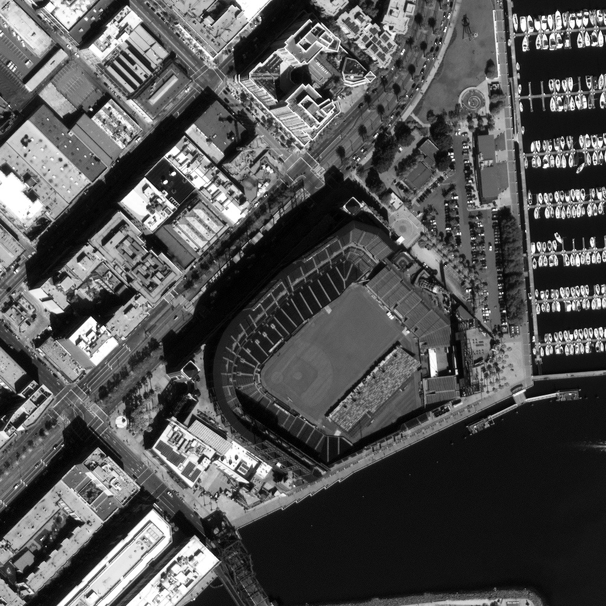
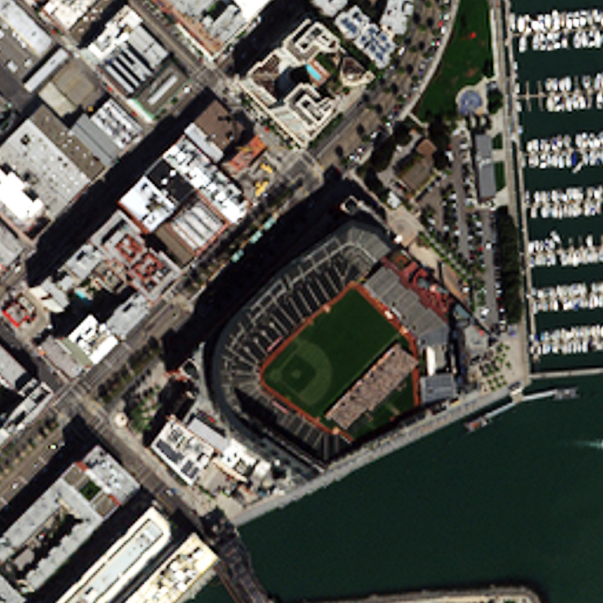

 **```**

```c++
#include <iostream>
#include <cmath>
using namespace std;
#include "./gdal/gdal_priv.h"
#pragma comment(lib, "gdal_i.lib")


int main()
{
	char* mulpath = "American_Mul.bmp";
	char* panpath = "American_Pan.bmp";
	char*fuspath = "American_Pus.tif";
  
	GDALAllRegister();//注册驱动
	GDALDataset* poMulDS, *poPanDS, *poPusDS;
	int imgXlen, imgYlen,i;
	float* bandR, *bandG, *bandB, *bandI, *bandH, *bandS;
	float* bandP;
	poMulDS = (GDALDataset*)GDALOpenShared(mulpath, GA_ReadOnly);
	poPanDS= (GDALDataset*)GDALOpenShared(panpath, GA_ReadOnly);
	imgXlen = poMulDS->GetRasterXSize();
	imgYlen = poMulDS->GetRasterYSize();
	poPusDS = GetGDALDriverManager()->GetDriverByName("GTiff")->Create(fuspath, imgXlen, imgYlen, 3, GDT_Byte, NULL);
	bandR = (float*)CPLMalloc(imgXlen*imgYlen * sizeof(float));
	bandG = (float*)CPLMalloc(imgXlen*imgYlen * sizeof(float));
	bandB = (float*)CPLMalloc(imgXlen*imgYlen * sizeof(float));
	bandP = (float*)CPLMalloc(imgXlen*imgYlen * sizeof(float));
	bandI = (float*)CPLMalloc(imgXlen*imgYlen * sizeof(float));
	bandH = (float*)CPLMalloc(imgXlen*imgYlen * sizeof(float));
	bandS = (float*)CPLMalloc(imgXlen*imgYlen * sizeof(float));
	poMulDS->GetRasterBand(1)->RasterIO(GF_Read, 0, 0, imgXlen, imgYlen,
		bandR, imgXlen, imgYlen, GDT_Float32, 0, 0);
	poMulDS->GetRasterBand(2)->RasterIO(GF_Read, 0, 0, imgXlen, imgYlen, bandG, imgXlen, imgYlen, GDT_Float32, 0, 0);
	poMulDS->GetRasterBand(3)->RasterIO(GF_Read, 0, 0, imgXlen, imgYlen, bandB, imgXlen, imgYlen, GDT_Float32, 0, 0);
	poPanDS->GetRasterBand(1)->RasterIO(GF_Read, 0, 0, imgXlen, imgYlen, bandP, imgXlen, imgYlen, GDT_Float32, 0, 0);
	for (i = 0; i < imgXlen*imgYlen; i++)
	{
		bandH[i] = -sqrt(2.0f) / 6.0f*bandR[i] - sqrt(2.0f) / 6.0f*bandG[i] + sqrt(2.0f) / 3.0f*bandB[i];
		bandS[i] = 1.0f / sqrt(2.0f)*bandR[i] - 1 / sqrt(2.0f)*bandG[i];

		bandR[i] = bandP[i] - 1.0f / sqrt(2.0f)*bandH[i] + 1.0f / sqrt(2.0f)*bandS[i];
		bandG[i] = bandP[i] - 1.0f / sqrt(2.0f)*bandH[i] - 1.0f / sqrt(2.0f)*bandS[i];
		bandB[i] = bandP[i] + sqrt(2.0f)*bandH[i];
	}
  //融合

	poPusDS->GetRasterBand(1)->RasterIO(GF_Write, 0, 0, imgXlen, imgYlen,
		bandR, imgXlen, imgYlen, GDT_Float32, 0, 0);
	poPusDS->GetRasterBand(2)->RasterIO(GF_Write, 0, 0, imgXlen, imgYlen,
		bandG, imgXlen, imgYlen, GDT_Float32, 0, 0);
	poPusDS->GetRasterBand(3)->RasterIO(GF_Write, 0, 0, imgXlen, imgYlen,
		bandB, imgXlen, imgYlen, GDT_Float32, 0, 0);
		CPLFree(bandR);
	CPLFree(bandG);
	CPLFree(bandB);
	CPLFree(bandI);
	CPLFree(bandH);
	CPLFree(bandS);
	CPLFree(bandP);

	GDALClose(poMulDS);
	GDALClose(poPanDS);
	GDALClose(poPusDS);


	return 0;
}


```
    ](American_Fus.jpg)